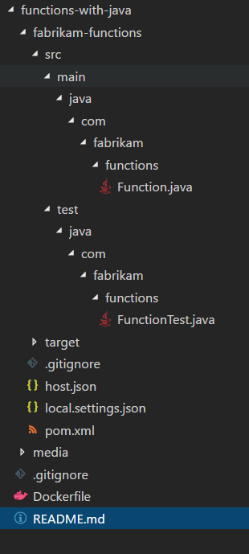
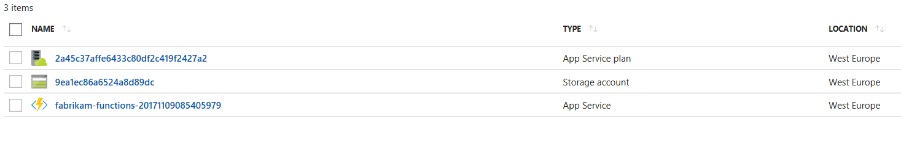

# Running Azure Functions with Java code

## Disclaimer
>This repository is in no means production ready. It is also by no means a best practice. I can just give an idea how to get started with this topic. All code is used at your own risk.

## Idea
This repository shows how to use azure functions with java.
While it is not always wanted to install the necessary dependencies on the developers machine, which in this particular case is for instance the need for node.js version 8.x, it is possible to have all the dependencies within a docker container. In this example a docker container is used to setup the development environment and to create the necessary scaffolding. Once the code is ready, it can be started within the container and when wired up correctly, tested locally.
For the sake of completeness the container image also contains the Azure CLI which allows the Function to be deployed to Azure directly. Details about all the requirements necessary can be found here. 

[Azure Fuction Documentaion](https://docs.microsoft.com/en-us/azure/azure-functions/functions-create-first-java-maven)


## Generating the docker image

Based on the Dockerfile an image using the following command can be created.

```bash
docker build -t ralphw/javafunc .
```

The creation of the image might look something like this.

```bash
PS C:\Work\git\CSA-OCP-GER\functions-with-java> docker build -t ralphw/javafunc .
Sending build context to Docker daemon  58.37kB
Step 1/12 : FROM openjdk:8u151-jdk
 ---> 377371113dab
Step 2/12 : RUN sh -c 'echo "deb http://security.debian.org/debian-security jessie/updates main " >> /etc/apt/sources.list'
 ---> Running in 3449ce686576
 ---> a3a1c977511c
Removing intermediate container 3449ce686576
Step 3/12 : RUN curl -sL https://deb.nodesource.com/setup_8.x | bash -
 ---> Running in 74d330401508

## Installing the NodeSource Node.js v8.x repo...


## Populating apt-get cache...

+ apt-get update
Ign:1 http://deb.debian.org/debian stretch InRelease
Get:2 http://security.debian.org stretch/updates InRelease [63.0 kB]
Get:3 http://deb.debian.org/debian stretch-updates InRelease [91.0 kB]
Get:4 http://security.debian.org/debian-security jessie/updates InRelease [63.1 kB]
Get:5 http://deb.debian.org/debian stretch Release [118 kB]
Get:6 http://deb.debian.org/debian stretch Release.gpg [2479 B]
Get:7 http://security.debian.org stretch/updates/main amd64 Packages [279 kB]
Get:8 http://deb.debian.org/debian stretch-updates/main amd64 Packages [6499 B]
Get:9 http://security.debian.org/debian-security jessie/updates/main amd64 Packages [610 kB]
Get:10 http://deb.debian.org/debian stretch/main amd64 Packages [9500 kB]
Fetched 10.7 MB in 3s (2713 kB/s)
Reading package lists...

## Installing packages required for setup: apt-transport-https lsb-release...

+ apt-get install -y apt-transport-https lsb-release > /dev/null 2>&1

## Confirming "stretch" is supported...

+ curl -sLf -o /dev/null 'https://deb.nodesource.com/node_8.x/dists/stretch/Release'

## Adding the NodeSource signing key to your keyring...

+ curl -s https://deb.nodesource.com/gpgkey/nodesource.gpg.key | apt-key add -
Warning: apt-key output should not be parsed (stdout is not a terminal)
OK

## Creating apt sources list file for the NodeSource Node.js v8.x repo...

+ echo 'deb https://deb.nodesource.com/node_8.x stretch main' > /etc/apt/sources.list.d/nodesource.list
+ echo 'deb-src https://deb.nodesource.com/node_8.x stretch main' >> /etc/apt/sources.list.d/nodesource.list

## Running `apt-get update` for you...

+ apt-get update
Ign:1 http://deb.debian.org/debian stretch InRelease
Hit:2 http://deb.debian.org/debian stretch-updates InRelease
Hit:3 http://security.debian.org stretch/updates InRelease
Hit:4 http://security.debian.org/debian-security jessie/updates InRelease
Hit:5 http://deb.debian.org/debian stretch Release
Get:7 https://deb.nodesource.com/node_8.x stretch InRelease [4647 B]
Get:8 https://deb.nodesource.com/node_8.x stretch/main Sources [762 B]
Get:9 https://deb.nodesource.com/node_8.x stretch/main amd64 Packages [1009 B]
Fetched 6418 B in 1s (4281 B/s)
Reading package lists...

<snip>
 ....
 Too long to be posted completely
 ....
</snip>

+ azure-functions-core-tools@2.0.1-beta.21
added 45 packages in 27.983s
 ---> 224c99c30a03
Removing intermediate container 39fb0ba263ee
Step 10/12 : VOLUME /app
 ---> Running in 89c5fcfb0dab
 ---> d7b0e30f3532
Removing intermediate container 89c5fcfb0dab
Step 11/12 : WORKDIR /app
 ---> 41559386ec84
Removing intermediate container 2e8f9ed2a098
Step 12/12 : EXPOSE 7071
 ---> Running in fa914ece3c14
 ---> a689751fcd11
Removing intermediate container fa914ece3c14
Successfully built a689751fcd11
Successfully tagged ralphw/javafunc:latest
```


The result is an image within the local docker repository.

```bash
PS C:\Work\git\CSA-OCP-GER\functions-with-java> docker images
REPOSITORY          TAG                 IMAGE ID            CREATED             SIZE
ralphw/javafunc     latest              a8099c430c6f        2 days ago          2.63GB
```

## Starting the container interactively

Once the setup is done, the image can be started to either generate the required scaffolding or do simply invoke the generated function within the function runtime. Hence, when the function is started by the runtime, a port for the function will be exposed. In this particular example, the runtime decided to use port 7071. Therefore the container is started mapping the machines port 7071 to the containers port 7071. In addition to the port a local folder is mapped to a folder within the container. This allows to have the generated code being written to the machines disk, where also an integration to a source code repository like git can be leveraged. Not mapping the  folder would mean, that the generated content is lost once the container is deleted. 

```bash
docker run -it -p 7071:7071 -v C:\Work\git\CSA-OCP-GER\functions-with-java:/app ralphw/javafunc
```
## Generating the java function

Once the container is in place, it can be used to generate the necessary java code required for the function as stated within the Azure Documentation mentioned above.

```bash
root@99d6e7f9323a:/app# mvn archetype:generate -DarchetypeGroupId=com.microsoft.azure -DarchetypeArtifactId=azure-functions-archetype
```

The only required information for this step is to provide some names for the function to be generaed.

```bash
Define value for property 'groupId': com.fabrikam.functions
Define value for property 'artifactId': fabrikam-functions
Define value for property 'version' 1.0-SNAPSHOT: :
Define value for property 'package' com.fabrikam.functions: :
Define value for property 'appName' fabrikam-functions-20171109085405979: :
Define value for property 'appRegion' westus: : westeurope
Confirm properties configuration:
groupId: com.fabrikam.functions
artifactId: fabrikam-functions
version: 1.0-SNAPSHOT
package: com.fabrikam.functions
appName: fabrikam-functions-20171109085405979
appRegion: westeurope
 Y: : y
[INFO] ----------------------------------------------------------------------------
[INFO] Using following parameters for creating project from Archetype: azure-functions-archetype:1.2
[INFO] ----------------------------------------------------------------------------
[INFO] Parameter: groupId, Value: com.fabrikam.functions
[INFO] Parameter: artifactId, Value: fabrikam-functions
[INFO] Parameter: version, Value: 1.0-SNAPSHOT
[INFO] Parameter: package, Value: com.fabrikam.functions
[INFO] Parameter: packageInPathFormat, Value: com/fabrikam/functions
[INFO] Parameter: appName, Value: fabrikam-functions-20171109085405979
[INFO] Parameter: package, Value: com.fabrikam.functions
[INFO] Parameter: version, Value: 1.0-SNAPSHOT
[INFO] Parameter: groupId, Value: com.fabrikam.functions
[INFO] Parameter: appRegion, Value: westeurope
[INFO] Parameter: artifactId, Value: fabrikam-functions
[INFO] Project created from Archetype in dir: /app/fabrikam-functions
[INFO] ------------------------------------------------------------------------
[INFO] BUILD SUCCESS
[INFO] ------------------------------------------------------------------------
[INFO] Total time: 07:41 min
[INFO] Finished at: 2017-11-09T08:54:13+00:00
[INFO] Final Memory: 19M/158M
[INFO] ------------------------------------------------------------------------
```

This is what the generated contend looks like:




## Starting the generated function

Once the code is in place the function can be built and started using maven

```bash
root@99d6e7f9323a:/app# cd fabrikam-functions
root@99d6e7f9323a:/app/fabrikam-functions# mvn clean package 

...

[INFO]
[INFO] Step 1 of 6: Searching for Azure Function entry points
[INFO] Reflections took 301 ms to scan 1 urls, producing 1 keys and 1 values
[INFO] 1 Azure Function entry point(s) found.
[INFO]
[INFO] Step 2 of 6: Generating Azure Function configurations
[INFO] Generation done.
[INFO]
[INFO] Step 3 of 6: Validating generated configurations
[INFO] Validation done.
[INFO]
[INFO] Step 4 of 6: Saving empty host.json
[INFO] Successfully saved to /app/fabrikam-functions/target/azure-functions/fabrikam-functions-20171109085405979/host.json
[INFO]
[INFO] Step 5 of 6: Saving configurations to function.json
[INFO] Starting processing function: hello
[INFO] Successfully saved to /app/fabrikam-functions/target/azure-functions/fabrikam-functions-20171109085405979/hello/function.json
[INFO]
[INFO] Step 6 of 6: Copying JARs to staging directory /app/fabrikam-functions/target/azure-functions/fabrikam-functions-20171109085405979
[INFO] Using 'UTF-8' encoding to copy filtered resources.
[INFO] Copying 1 resource to /app/fabrikam-functions/target/azure-functions/fabrikam-functions-20171109085405979
[INFO] Copied successfully.
[INFO] Successfully built Azure Functions.
[INFO]
[INFO] --- maven-resources-plugin:3.0.2:copy-resources (copy-resources) @ fabrikam-functions ---
[INFO] Using 'UTF-8' encoding to copy filtered resources.
[INFO] Copying 2 resources
[INFO] ------------------------------------------------------------------------
[INFO] BUILD SUCCESS
[INFO] ------------------------------------------------------------------------
[INFO] Total time: 58.664 s
[INFO] Finished at: 2017-11-09T08:58:31+00:00
[INFO] Final Memory: 52M/297M
[INFO] ------------------------------------------------------------------------
```

Now that the function is compiled it is time to start the function runtime with the generated jar file.

```bash
root@99d6e7f9323a:/app/fabrikam-functions# mvn azure-functions:run

...

[INFO] Scanning for projects...
[INFO]
[INFO] ------------------------------------------------------------------------
[INFO] Building Azure Java Functions 1.0-SNAPSHOT
[INFO] ------------------------------------------------------------------------
[INFO]
[INFO] --- azure-functions-maven-plugin:0.1.6:run (default-cli) @ fabrikam-functions ---
AI: INFO 09-11-2017 09:02, 1: Configuration file has been successfully found as resource
AI: INFO 09-11-2017 09:02, 1: Configuration file has been successfully found as resource
[INFO] Azure Functions stage directory found at: /app/fabrikam-functions/target/azure-functions/fabrikam-functions-20171109085405979
[INFO] Azure Functions Core Tools found.
[INFO] Starting running Azure Functions...

                  %%%%%%
                 %%%%%%
            @   %%%%%%    @
          @@   %%%%%%      @@
       @@@    %%%%%%%%%%%    @@@
     @@      %%%%%%%%%%        @@
       @@         %%%%       @@
         @@      %%%       @@
           @@    %%      @@
                %%
                %

[11/9/17 9:03:05 AM] Reading host configuration file '/app/fabrikam-functions/target/azure-functions/fabrikam-functions-20171109085405979/host.json'
[11/9/17 9:03:05 AM] Host configuration file read:
[11/9/17 9:03:05 AM] {}
info: Worker.Java.891e1b79-c8ec-48b7-8480-0b38d9931037[0]
      Start Process: /docker-java-home/bin/java  -jar -agentlib:jdwp=transport=dt_socket,server=y,suspend=n,address=5005 "/root/.azurefunctions/bin/workers/java/azure-functions-java-worker.jar" --host 127.0.0.1 --port 39565 --workerId 891e1b79-c8ec-48b7-8480-0b38d9931037 --requestId b65201ac-4980-47fa-bf52-cb8c5fb992d1
[11/9/17 9:03:07 AM] Generating 1 job function(s)
[11/9/17 9:03:07 AM] Starting Host (HostId=99d6e7f9323a-803323446, Version=2.0.11370.0, ProcessId=245, Debug=False, ConsecutiveErrors=0, StartupCount=0, FunctionsExtensionVersion=)
info: Worker.Java.891e1b79-c8ec-48b7-8480-0b38d9931037[0]
      Listening for transport dt_socket at address: 5005
info: Worker.Java.891e1b79-c8ec-48b7-8480-0b38d9931037[0]
      Microsoft Azure Functions Java Runtime [build 1.0.0-beta-2]
[11/9/17 9:03:07 AM] Found the following functions:
[11/9/17 9:03:07 AM] Host.Functions.hello
[11/9/17 9:03:07 AM]
[11/9/17 9:03:07 AM] Job host started
Listening on http://localhost:7071/
Hit CTRL-C to exit...

Http Functions:

        hello: http://localhost:7071/api/hello

info: Worker.Java.891e1b79-c8ec-48b7-8480-0b38d9931037[0]
      [INFO] {MessageHandler.handle}: Message generated by "StartStream.Builder"
info: Worker.Java.891e1b79-c8ec-48b7-8480-0b38d9931037[0]
      Worker initialized
info: Worker.Java.891e1b79-c8ec-48b7-8480-0b38d9931037[0]
      "hello" loaded (ID: 4ca31a77-146b-4d00-974e-1bbce47d3633, Reflection: "/app/fabrikam-functions/target/azure-functions/fabrikam-functions-20171109085405979/fabrikam-functions-1.0-SNAPSHOT.jar"::"com.fabrikam.functions.Function.hello")
```

This will expose an endpoint on localhost:7071/api/hello. To ensure everything is fine and running as expected

The function can be tested using the command
```bash
root@99d6e7f9323a:/app/fabrikam-functions# curl -w '\n' http://localhost:7071/api/hello -d AzureFunctions

[11/9/17 9:06:44 AM] Function started (Id=c876d6ac-c66b-4803-81ed-81a6900b51e9)
[11/9/17 9:06:44 AM] Executing 'Functions.hello' (Reason='This function was programmatically called via the host APIs.', Id=c876d6ac-c66b-4803-81ed-81a6900b51e9)
[11/9/17 9:06:45 AM] Java HTTP trigger processed a request.
[11/9/17 9:06:45 AM] Function "hello" (ID: 3441f3e9-b75c-41a3-a904-baf26468595d) invoked by Java Worker
[11/9/17 9:06:45 AM] Function completed (Success, Id=c876d6ac-c66b-4803-81ed-81a6900b51e9, Duration=1451ms)
[11/9/17 9:06:45 AM] Executed 'Functions.hello' (Succeeded, Id=c876d6ac-c66b-4803-81ed-81a6900b51e9)

Hello, AzureFunctions
```

## Deploying to Azure

Now that the function is in place an tested locally it is ready to be deployed to azure. Of course this is only one possibility to deploy to Azure and is probable not exaclty the CI/CD style, but for a demonstration it will be sufficient.

```bash
root@99d6e7f9323a:/app/fabrikam-functions# az login
root@99d6e7f9323a:/app/fabrikam-functions# mvn azure-functions:deploy

...

[INFO] Scanning for projects...
[INFO]
[INFO] ------------------------------------------------------------------------
[INFO] Building Azure Java Functions 1.0-SNAPSHOT
[INFO] ------------------------------------------------------------------------
[INFO]
[INFO] --- azure-functions-maven-plugin:0.1.6:deploy (default-cli) @ fabrikam-functions ---AI: INFO 09-11-2017 09:12, 1: Configuration file has been successfully found as resourceAI: INFO 09-11-2017 09:12, 1: Configuration file has been successfully found as resource
[INFO] Starting deploying to Function App fabrikam-functions-20171109085405979...
[INFO] Authenticate with Azure CLI 2.0
[INFO] Target Function App does not exist. Creating a new Function App ...
[INFO] Successfully created Function App fabrikam-functions-20171109085405979
[INFO]
[INFO] Step 1 of 4: Creating ZIP package...[INFO] Successfully saved ZIP package at /app/fabrikam-functions/target/azure-functions/fabrikam-functions-20171109085405979.zip
[INFO]
[INFO] Step 2 of 4: Uploading ZIP package to Azure Storage...
[INFO] Successfully uploaded ZIP package to https://9ea1ec86a6524a8d89dc.blob.core.windows.net/java-functions-deployment-packages/fabrikam-functions-20171109085405979.20171109091400180.zip
[INFO]
[INFO] Step 3 of 4: Deploying Function App with package...
[INFO] Successfully deployed Function App with package.
[INFO]
[INFO] Step 4 of 4: Deleting deployment package from Azure Storage...
[INFO] Successfully deleted deployment package fabrikam-functions-20171109085405979.20171109091400180.zip
[INFO] Successfully deployed Function App at https://fabrikam-functions-20171109085405979.azurewebsites.net
[INFO] ------------------------------------------------------------------------
[INFO] BUILD SUCCESS
[INFO] ------------------------------------------------------------------------
[INFO] Total time: 01:53 min
[INFO] Finished at: 2017-11-09T09:14:20+00:00
[INFO] Final Memory: 45M/342M[INFO] ------------------------------------------------------------------------


root@99d6e7f9323a:/app/fabrikam-functions# curl -w '\n' https://fabrikam-functions-20171109085405979.azurewebsites.net/api/hello -d AzureFunctions
Hello, AzureFunctions

```
Resources generated in Azure:



That's it. The sample function is deployed to azure and ready to run. All is done within a docker container. Thanks to that it is completely hassle free since no dependencies on the dev machine get messed up.